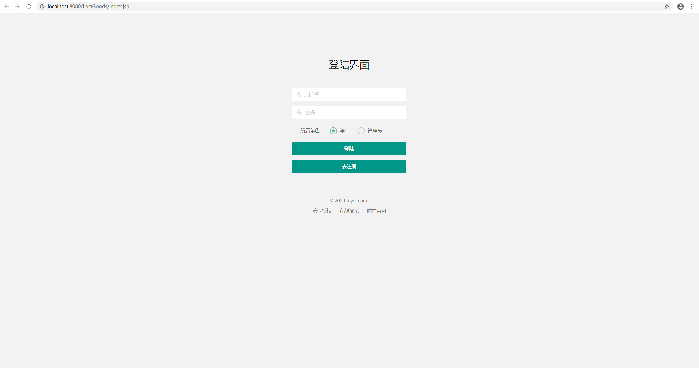
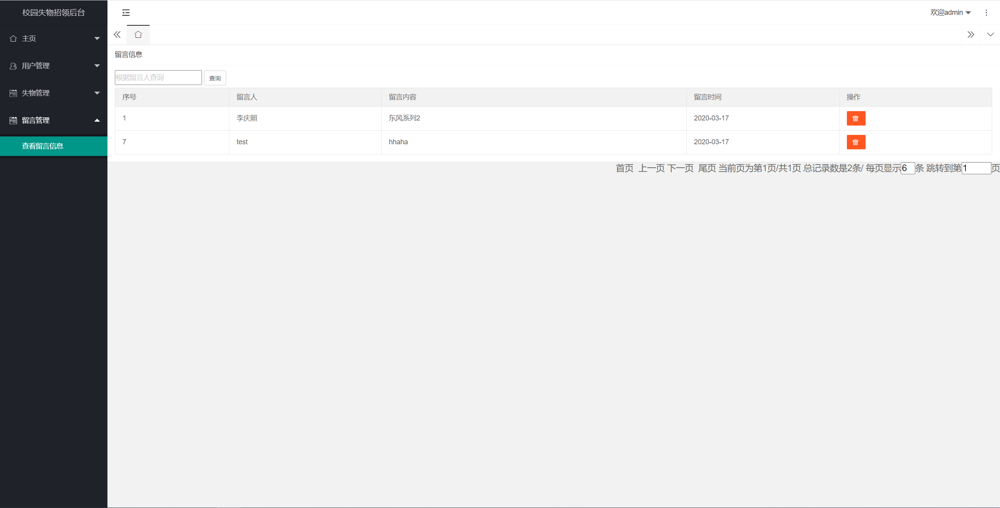
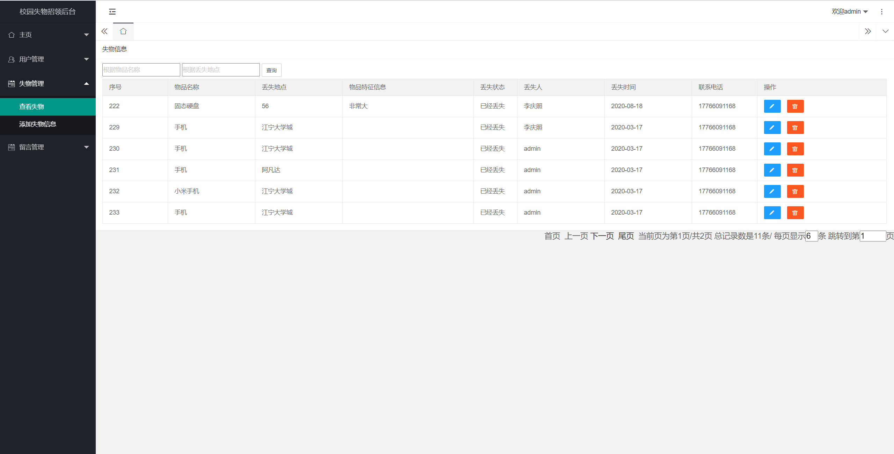
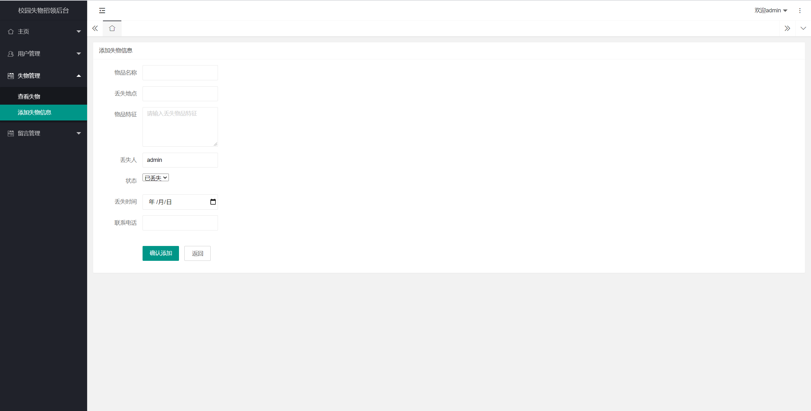
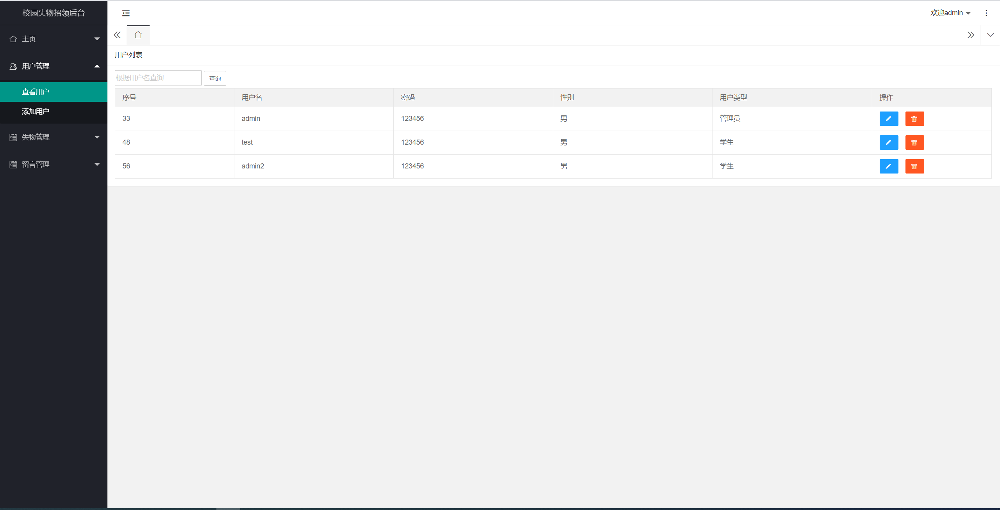
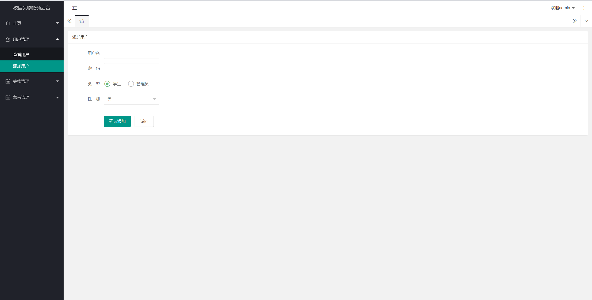
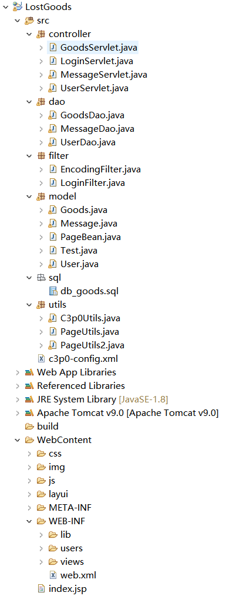

<h1 align="center">基于JSP+Servlet实现的校园失物招领系统</h1>

 获取sql文件 QQ: 3645296857 QQ群: 978300347 

<h4> 需要视频演示可联系上述QQ，私发视频链接 </h4>

 获取更多高质量源码，请访问：[mzoo源码网](https://mzoocodes.com/)

## 简介

> 本代码来源于网络,仅供学习参考使用!
>
> <b style="color: dodgerblue"> 提供1.远程部署/2.修改代码/3.定制程序/4.文档指导/5.框架代码讲解、技术解答、代码讲解等服务 </b>
>
> 登录地址：http://localhost:8080
>
> 管理员: admin 密码: 123456
> 
> 失主：zhangsan 密码: 123456

## 项目介绍

基于JSP+Servlet实现的校园失物招领系统：前端 JSP、BootStrap、JQuery、Ajax，后端 Servlet，系统角色分为：管理员和学生。管理员在管理端对系统用户进行管理，可以查看失物发布情况、留言信息等；失主可以对发布挂失信息、留言等。主要功能如下：

### 管理员
- 基本操作：登录、注册、修改密码、修改个人信息、登出
- 用户管理：筛选用户信息、添加用户信息、获取用户信息列表、查看用户信息详情
- 失物管理：筛选失物信息、发布失物信息、获取失物信息列表、查看失物信息详情
- 留言管理：筛选留言信息、获取留言信息列表、查看留言信息详情

### 学生
- 基本操作：登录、注册、修改密码、修改个人信息、登出
- 用户管理：筛选用户信息、添加用户信息、获取用户信息列表、查看用户信息详情
- 失物模块：获取失物信息列表、查看失物信息详情、挂失
- 留言管理：获取留言信息列表、查看留言信息详情、留言、修改留言内容、删除留言、查看我的留言

## 环境

- <b>IntelliJ IDEA 2020.3</b>

- <b>Mysql 5.7.26</b>

- <b>Tomcat 9.0.41</b>

- <b>JDK 1.8</b>

## 运行截图

